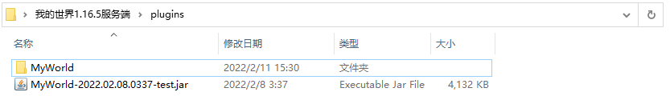
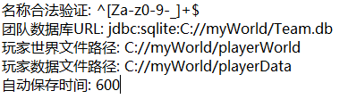
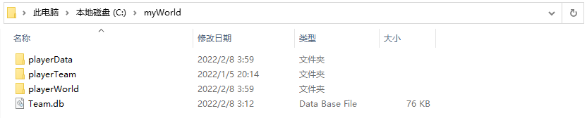

# 不使用bc群组
## 安装插件
下载插件jar包，放入支持bukkit插件的我的世界服务端中的plugins文件夹中，然后启动服务端。
插件会在plugins文件夹中生成MyWorld文件夹。这说明插件安装超过了。

## 配置插件
### FileConfig.yml

首先你需要配置数据文件保存到的位置。因为你已经启动了服务器并且加载了插件，不出意外，插件已经在你的c盘生成了文件。

你可以按照配置文件中的格式修改数据存储路径，但是需要注意格式。
例如：

“C:/xxx/xxx” 是绝对路径，这个无序更多介绍了，这个可以直接从支援管理器中复制。

"xxx/xxx" 是相对路径,是从服务端开始的。例如“world/myWorld”的所在位置就是

在不使用使用bc群组的情况下，使用相对路径更好。这也可以很方便地转移服务端的位置从而不用修改配置文件。
### PlayerDataConfig.yml

#### 使用玩家名称保存数据
- true 将使用玩家名存储玩家的背包数据和团队数据。
- false 将使用uuid存储玩家的背包数据和团队数据。

如果你是正版服务器，建议false。
# 使用bc群组