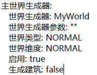
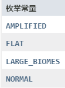
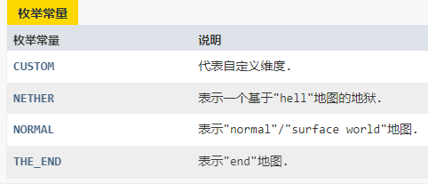

插件可以不使用bc群组，也可是使用bc群组。下面先介绍简单的不使用bc群组
# 不使用bc群组
## 安装插件
下载插件jar包，放入支持bukkit插件的我的世界服务端中的plugins文件夹中，然后启动服务端。
插件会在plugins文件夹中生成MyWorld文件夹。这说明插件安装超过了。

## 配置插件
### FileConfig.yml

首先你需要配置数据文件保存到的位置。因为你已经启动了服务器并且加载了插件，不出意外，插件已经在你的c盘生成了文件。

你可以按照配置文件中的格式修改数据存储路径，但是需要注意格式。
例如：

“C:/xxx/xxx” 是绝对路径，这个无序更多介绍了，这个可以直接从支援管理器中复制。

"xxx/xxx" 是相对路径,是从服务端开始的。例如“world/myWorld”的所在位置就是

在不使用使用bc群组的情况下，使用相对路径更好。这也可以很方便地转移服务端的位置从而不用修改配置文件。
### PlayerDataConfig.yml

#### 使用玩家名称保存数据
- true 将使用玩家名存储玩家的背包数据和团队数据。
- false 将使用uuid存储玩家的背包数据和团队数据。

如果你是正版服务器，建议false。
#### 保存玩家非玩家世界位置
这个开关看起来难以理解，但是很简单。
- true 玩家上线后，数据加载完成时返回到上次在服务器世界的位置（是服务器的世界，不是玩家自己的世界）
- false 玩家上线后，数据加载完成后依然在出生点。

#### 玩家数据解锁检测间隙
在不使用使用bc群组的情况下，此选项无需修改。

### TeamConfig.yml

无需多说，一看懂。

### WorldConfig.yml
这个配置文件看起来较为复杂，其实选项很少。我们先去掉选项的值。

#### 无玩家世界最短卸载时间
插件会每隔一段世界扫描没有玩家在的世界，如果这个世界没有玩家就会标记为“即将回收”，如果有玩家加入了这个世界就会撤销这个标记。
在下一次扫描中如果发现有标记为“即将回收”的世界将会被卸载。
也就是说，你填600秒，那么没有玩家的世界将在600~1200秒后被卸载。

#### 创建世界后传送到世界
玩家在使用创建世界命令的时候，世界创建完成后会把玩家传送到他创建的世界。

#### 主世界名称
请与你服务端的主世界名称保持一致，也就是”server.properties“文件中的“level-name=”，为了插件正常工作，请留意此选项。

#### 禁止玩家使用的世界名称列表
用于放在玩家创建的世界与服务器中的世界重名。
如果需要添加，可以按照格式添加。

#### 自动配置服务器名称
在不使用使用bc群组的情况下，建议设置为false

#### 服务器名称
在不使用使用bc群组的情况下，此选项无需修改。

#### 主世界生成器
用于修改主世界的生成参数，下方有6个子项目。

##### 世界生成器
一般都是填插件名称，如果你使用MyWorld插件来生成地形，你就可以填写MyWorld。MyWorld插件是有地形生成功能的，但是非常简陋。只能生成虚空世界。
所以如果你不修改此配置，你创建的世界会是一个虚空世界，
如果你想使用原版地形，那么你可以填写“Minecraft”。

##### 世界生成器参数
这个一般不用填写，如果你需要自定义生成器参数，那么不妨试试。

##### 世界类型
就是普通，超平坦，放大化什么什么的。

请参考 “https://bukkit.windit.net/javadoc/org/bukkit/WorldType.html”

##### 世界维度
就是主世界，地狱，末地什么什么的。

请参考 “https://bukkit.windit.net/javadoc/org/bukkit/World.Environment.html”

##### 启用
主世界不允许关闭
- true 玩家可以拥有自己的主世界
- false 你就算是设置了false，我还是true

##### 生成建筑
- true 会生成村装什么的
- false 不会生成

#### 地狱界生成器
没有写的选项均和主世界相同

##### 启用
- true 玩家可以拥有自己的地狱
- false 不会给玩家提供地狱

#### 末地界生成器
没有写的选项均和主世界相同

##### 启用
- true 玩家可以拥有自己的地狱
- false 不会给玩家提供地狱

## 命令
/myWorld <操作>
### 创建团队 <--> NewTeam
/myWorld 创建团队 <团队名称>

团队名称必须唯一，创建者必须不在任何团队中。
### 解散团队 <--> DisbandOurTeam
/myWorld 解散团队 [确认 or yse]

解散团队必须在参数中使用“确认”或“yes”来表示确认要解散团队。
只有创建者才能解散团队。

### 邀请成员 <--> InviteFriend
/myWorld 解散团队 <玩家名称>

邀请一个玩家加入你所在的团队。被邀请的玩家必须接受邀请。
### 接受邀请 <--> AcceptInvitation
/myWorld 接受邀请

接受其他玩家的邀请。

### 创建世界 <--> NewWord
/myWorld 创建世界 <世界名称>

执行者必须是团长。

### 去出生点 <--> goBeginningPoint
/myWorld 去出生点

去所在团队世界的出生点。

### 退出团队 <--> QuitThisTeam
/myWorld 退出团队

团长不能退出团队。
### 添加信任 <--> TrustHim
/myWorld 添加信任 <玩家名称>

信任的玩家和团队中的成员不同，信任的玩家拥有您所在世界的建筑权限。但只能通过tp在您世界中的玩家的方式进入您团队所在的世界。
### 取消信任 <--> DistrustHim
/myWorld 取消信任 <玩家名称>

# 使用bc群组
我好累啊，先不写了。自己研究下哈。给个提示。
请保证每个服务器FileConfig.yml完全相同啊。